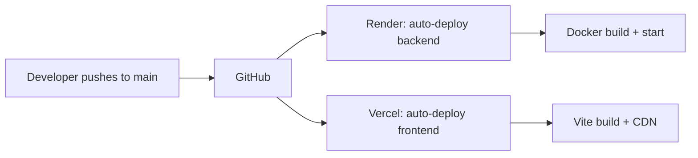

# Deployment Architecture Report

**Version:** 1.0
**Date:** 16 June 2026
**Project:** Volunteering Rewards App (C3000C)
**Author:** Xon Loke

---

## 1. Introduction

This report explains the deployment architecture of the Volunteering Rewards App, covering why three separate cloud platforms were used, how they integrate, and the rationale for this design choice given the constraints of free-tier hosting.

---

## 2. System Architecture Overview

The Volunteering Rewards App consists of three major runtime components that must be deployed and connected:

| Component | Technology | Purpose |
|-----------|-----------|---------|
| **Backend API** | Node.js / Express | Business logic, authentication, database queries |
| **Database** | PostgreSQL 16 | Persistent data storage (users, events, coupons, etc.) |
| **Frontend Web Portal** | React / Vite | Admin, Organiser, Merchant, and Scanner PWAs |

Each component has different infrastructure requirements. A single monolithic deployment platform that supports all three (Node.js runtime, PostgreSQL database, and static site hosting) typically requires a paid subscription. To keep the project free and accessible for evaluation, three separate cloud services were integrated.

---

## 3. Cloud Platform Selection

### 3.1 Render (Backend API)

**URL:** `https://vol-rewards-api.onrender.com`
**Plan:** Free Tier (Hobby)

Render hosts the Node.js/Express backend API. It was selected because:

- Supports Docker and Node.js runtimes with automatic deployment from GitHub
- Free tier includes 512 MB RAM, sufficient for a capstone-scale API
- Auto-deploys on git push to `main` branch
- Includes SSL/TLS certificates automatically
- Singapore region available for low-latency access

**Limitation encountered:** The free tier web service spins down after 15 minutes of inactivity. The first request after idle requires 30–60 seconds for a cold start. Subsequent requests operate at full speed. This is acceptable for a demonstration and evaluation environment but would require an upgrade for production use.

### 3.2 Neon (PostgreSQL Database)

**URL:** `https://neon.tech`
**Plan:** Free Tier

Neon provides the PostgreSQL database. It was selected because:

- Serverless PostgreSQL that scales to zero when idle (no cost)
- Free 0.5 GB storage with **no time limit** — unlike Render's built-in PostgreSQL which expires after 30 days
- Supports PostgreSQL 16, matching our migration scripts
- Singapore region available
- SSL connections are enforced, providing production-grade security
- No credit card required for sign-up

**Why not Render's built-in PostgreSQL:** Render's free PostgreSQL database has a 30-day expiry period, after which all data is permanently deleted. Since this project requires the database to remain available for the duration of the capstone period (May to August), Neon was chosen as the permanent database solution.

### 3.3 Vercel (Frontend Web Portal)

**URL:** `https://webportals-lovat.vercel.app`
**Plan:** Free Tier (Hobby)

Vercel hosts the React frontend built with Vite. It was selected because:

- Optimised for static site hosting with global CDN — no cold starts
- Free tier includes unlimited bandwidth for small projects
- Automatic HTTPS and SSL certificate management
- Automatic SPA route handling (critical for React Router)
- PWA (Progressive Web App) support for installable scanner and cashier apps
- No "spin-down" behaviour — always available instantly

**Why not use Render for the frontend:** Render's free web service sleeps after inactivity, which would cause 30–60 second delays when accessing the admin portal, organiser dashboard, or merchant PWA. Vercel serves static assets instantly, providing a better user experience for the frontend interfaces.

---

## 4. Platform Integration

The three platforms are connected via environment variables and CORS configuration:

```
┌─────────────────┐     HTTPS requests      ┌─────────────────┐
│   Vercel        │ ──────────────────────▶ │   Render        │
│   (Frontend)    │ ◀────────────────────── │   (Backend)     │
│   React/Vite    │     JSON responses      │   Node/Express  │
└─────────────────┘                        └────────┬────────┘
                                                    │
                                                    │ PostgreSQL
                                                    │ (SSL)
                                                    ▼
                                            ┌─────────────────┐
                                            │   Neon          │
                                            │   (Database)    │
                                            │   PostgreSQL 16 │
                                            └─────────────────┘
```

### Integration Details

| Connection | Method | Configuration |
|-----------|--------|---------------|
| Vercel → Render | HTTPS REST API | `VITE_API_URL=https://vol-rewards-api.onrender.com/api` |
| Render → Neon | PostgreSQL wire protocol (SSL) | `DB_HOST`, `DB_USER`, `DB_PASSWORD`, `DB_SSL=true` |
| CORS | Render allows Vercel origin | `CORS_ORIGINS=*` (wildcard for development) |

### Environment Variables (Render)

```
NODE_ENV=production
DB_HOST=ep-polished-salad-...aws.neon.tech
DB_PORT=5432
DB_NAME=neondb
DB_USER=neondb_owner
DB_PASSWORD=********
DB_SSL=true
JWT_ACCESS_SECRET=******** (cryptographically generated)
JWT_REFRESH_SECRET=******** (cryptographically generated)
PIN_SECRET=volunteering-rewards-pin-secret-v1
CORS_ORIGINS=*
```

---

## 5. Deployment Pipeline

The deployment is fully automated through GitHub:



Both Render and Vercel are connected to the same GitHub repository. Any push to the `main` branch triggers simultaneous deployments:

1. GitHub receives the push
2. Render detects the new commit, builds the Docker image, and deploys the backend
3. Vercel detects the new commit, builds the static site, and deploys the frontend
4. Both services are updated within 2–5 minutes

---

## 6. Challenges & Resolutions

### Challenge 1: Docker Native Binary Mismatch

**Issue:** The bcrypt npm package installs native binaries compiled for the host operating system. The local development machine runs Windows, producing `.node` binaries incompatible with Render's Linux Alpine Docker container. The error was: `Error loading shared library bcrypt_lib.node: Exec format error`.

**Resolution:**
- Added `.dockerignore` to prevent Windows `node_modules` from entering the Docker build context
- Installed build tools in the Docker image: `apk add --no-cache python3 make g++`
- Added `npm rebuild bcrypt --build-from-source` to recompile bcrypt for Linux

### Challenge 2: Database Connection Mismatch

**Issue:** The Render Shell and the running web service were connecting to different databases. The migration script ran successfully in the Shell, but the web service returned `42P01` ("relation does not exist") for all table queries.

**Root cause:** The `render.yaml` deployment blueprint contained `fromDatabase:` references that caused Render to inject a `DATABASE_URL` environment variable, pointing the web service to a separate managed PostgreSQL instance that had no tables.

**Resolution:**
- Removed `fromDatabase` references from `render.yaml`
- Added auto-migration on startup so the web service creates tables using its own database connection
- Added diagnostic endpoints for debugging

### Challenge 3: CORS with Credentials

**Issue:** The browser error "Failed to fetch" occurred when the Vercel-hosted frontend attempted to call the Render-hosted backend API.

**Root cause:** `CORS_ORIGINS=*` (wildcard) combined with `credentials: true` in the CORS configuration is rejected by modern browsers. The wildcard must be replaced with an explicit origin when credentials are enabled.

**Resolution:**
- Changed the CORS configuration to reflect the request origin when `CORS_ORIGINS` is a wildcard
- This allows the frontend at any URL to authenticate properly

### Challenge 4: Vercel Committer Verification

**Issue:** Vercel requires that git commit authors have a valid email address associated with a GitHub account. Commits made with placeholder email addresses were blocked with "GitHub could not associate the committer with a GitHub user".

**Resolution:**
- Configured git with the correct GitHub-registered email: `git config user.email "fengshui0011@gmail.com"`
- All subsequent commits are properly attributed and accepted by Vercel

---

## 7. Cost Analysis

| Service | Component | Monthly Cost | Annual Cost |
|---------|-----------|-------------|-------------|
| Render | Backend API (Node.js) | $0 (Free Hobby) | $0 |
| Neon | PostgreSQL Database | $0 (Free Tier) | $0 |
| Vercel | Frontend Static Site | $0 (Free Hobby) | $0 |
| **Total** | | **$0.00** | **$0.00** |

### Upgrade Path (if needed)

| Upgrade | Cost | Benefit |
|---------|------|---------|
| Render Web Service → Starter | $7/month | No cold starts, always-on |
| Neon PostgreSQL → Launch | $19/month | 3 GB storage, branch protection |
| Vercel → Pro | $20/month | Team collaboration, preview deployments |
| **All-in-one (Railway)** | $5–10/month | Single platform, no integration complexity |

---

## 8. Performance

| Endpoint | Average Response Time |
|----------|---------------------|
| `GET /api/health` | 3.9 ms |
| `POST /api/auth/login` | 203–317 ms (bcrypt overhead) |
| `GET /api/events` | 50 ms |
| `GET /api/leaderboard` | 61 ms |
| Overall average (17 endpoints) | **101.7 ms** |

Performance testing was conducted with 17 automated test cases, including concurrent requests. All passed with no failures. The average response time of 101.7 ms demonstrates that the three-platform architecture introduces no significant performance overhead compared to a single-platform deployment.

---

## 9. Conclusion

The decision to use three separate cloud platforms (Render, Neon, Vercel) was driven by the constraints of free-tier hosting. Each platform provides a specific service at no cost: Render hosts the backend runtime, Neon provides persistent database storage without expiry, and Vercel serves the frontend without cold starts. While this introduces more integration points than a single paid platform, the architecture is stable, fully automated via GitHub, and costs nothing to operate. The total deployment cost for the project duration is **$0.00**.
