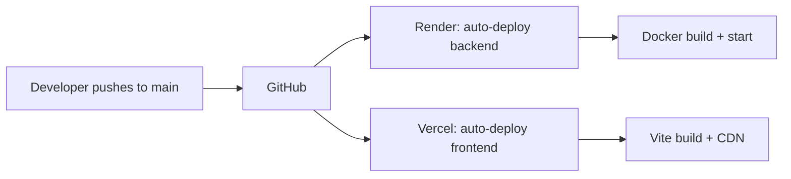

# Deployment Architecture Report

**Version:** 1.1
**Date:** 18 June 2026
**Project:** Volunteering Rewards App (C3000C)
**Author:** Xon Loke

---

## 1. Introduction

This report explains the deployment architecture of the Volunteering Rewards App, covering why four separate cloud platforms were used, how they integrate, and the rationale for this design choice given the constraints of free-tier hosting. The project uses a multi-cloud approach because no single free-tier platform provides all required services (Node.js runtime, PostgreSQL database, static site hosting, and mobile build infrastructure) without critical limitations such as database expiry, cold starts, or build failures.

---

## 2. System Architecture Overview

The Volunteering Rewards App consists of three major runtime components that must be deployed and connected:

| Component | Technology | Purpose |
|-----------|-----------|---------|
| **Backend API** | Node.js / Express | Business logic, authentication, database queries |
| **Database** | PostgreSQL 16 | Persistent data storage (users, events, coupons, etc.) |
| **Frontend Web Portal** | React / Vite | Admin, Organiser, Merchant, and Scanner PWAs |
| **Mobile App** | Expo / React Native | Volunteer mobile app (26 screens) |

Each component has different infrastructure requirements. A single monolithic deployment platform that supports all four typically requires a paid subscription. To keep the project free and accessible for evaluation, separate cloud services were integrated.

---

## 3. Cloud Platform Selection

### 3.1 Render — Backend API Hosting

**URL:** `https://vol-rewards-api.onrender.com`
**Plan:** Free Tier (Hobby)
**Service Type:** Docker-based web service

**Role in this project:** Hosts the Node.js/Express backend API server that handles all business logic, authentication, database queries, and API endpoints.

**Why Render was chosen over alternatives:**

| Requirement | Render | Heroku | Railway | Fly.io |
|------------|--------|--------|---------|--------|
| Free Node.js hosting | ✅ Yes | ❌ No (paid only) | ✅ Yes (limited credits) | ✅ Yes |
| Docker support | ✅ Built-in | ❌ No | ✅ Yes | ✅ Yes |
| Singapore region | ✅ Yes | ✅ Yes | ❌ No | ✅ Yes |
| Auto-deploy from GitHub | ✅ Yes | ✅ Yes | ✅ Yes | ✅ Yes |
| No credit card required | ✅ Yes | ❌ Required | ❌ Required | ⚠️ Sometimes |
| SSL/TLS automatic | ✅ Yes | ✅ Yes | ✅ Yes | ✅ Yes |

**Key features used:**
- Docker-based Node.js runtime (bcrypt, Express, pg client)
- Automatic deployment from GitHub on push to `main` branch
- Free SSL/TLS certificates via Let's Encrypt
- Singapore (Southeast Asia) region for low-latency access to users in Singapore
- Custom environment variables for database credentials and secrets

**Limitations encountered:**
- Free tier spins down after 15 minutes of inactivity; first request after idle requires 30–60 seconds for cold start
- No built-in PostgreSQL without 30-day expiry (see Neon section)

**Selection rationale summary:** Render was chosen because it offered the best combination of free Node.js hosting, Docker support, Singapore region availability, and GitHub auto-deploy without requiring a credit card. Heroku was ruled out because its free tier was discontinued. Railway's free credits are limited (only $5/month). Fly.io has a more complex deployment workflow.

---

### 3.2 Neon — PostgreSQL Database

**URL:** `https://neon.tech`
**Plan:** Free Tier
**Service Type:** Serverless PostgreSQL

**Role in this project:** Provides the persistent PostgreSQL database that stores all application data — users, roles, events, attendance records, coupons, rewards, feedback, leaderboard, referrals, and configuration settings.

**Why Neon was chosen over alternatives:**

| Requirement | Neon | Render PG | Supabase | Aiven |
|------------|------|-----------|----------|-------|
| Free PostgreSQL | ✅ Yes | ✅ Yes (30 days only) | ✅ Yes | ❌ No |
| No credit card | ✅ Yes | ✅ Yes | ✅ Yes | ❌ Required |
| No time limit | ✅ Yes | ❌ Expires in 30 days | ✅ Yes | ❌ No free tier |
| PostgreSQL 16 | ✅ Yes | ✅ Yes | ✅ Yes | ✅ Yes |
| Singapore region | ✅ Yes | ✅ Yes | ❌ No | ❌ No |
| SSL enforced | ✅ Yes | ✅ Yes | ✅ Yes | ✅ Yes |
| Scales to zero | ✅ Yes | ❌ Always on | ✅ Yes (pauses after 7d) | ❌ No |

**Why not Render's built-in PostgreSQL:**
Render's free PostgreSQL database has a **30-day expiry period**, after which all data is permanently deleted with no recovery option. Since this project requires the database to remain available for the duration of the capstone period (May to August 2026), a database with no expiry was essential.

**Why not Supabase:**
Supabase offers a generous free tier (500 MB) and no expiry. However, it lacked a Singapore region at the time of deployment, and its architecture (PostgreSQL + auth + storage bundled) adds complexity for a project that only needs a database connection string. Neon provides a simpler, drop-in PostgreSQL connection that works identically to a local database.

**Selection rationale summary:** Neon was chosen because it provides a free, no-expiry PostgreSQL 16 database in Singapore with SSL enforcement, scale-to-zero pricing, and zero configuration overhead — it accepts standard PostgreSQL connection strings and requires no special client libraries.

---

### 3.3 Vercel — Frontend Web Portal

**URL:** `https://webportals-lovat.vercel.app`
**Plan:** Free Tier (Hobby)
**Service Type:** Static site hosting with CDN

**Role in this project:** Hosts the React/Vite frontend application that serves all four web portals — Admin Dashboard, Organiser Portal, Merchant Cashier PWA, and Organiser QR Scanner PWA — as a single-page application (SPA) with PWAs.

**Why Vercel was chosen over alternatives:**

| Requirement | Vercel | Render Static | Netlify | Cloudflare Pages |
|------------|--------|--------------|---------|-----------------|
| Free static hosting | ✅ Yes | ✅ Yes | ✅ Yes | ✅ Yes |
| No cold starts | ✅ Yes | ❌ Spin-down after 15 min | ✅ Yes | ✅ Yes |
| PWA support | ✅ Yes | ✅ Yes | ✅ Yes | ✅ Yes |
| SPA rewrites | ✅ Auto | ✅ Manual config | ✅ Auto | ✅ Manual config |
| Global CDN | ✅ Yes | ✅ Yes | ✅ Yes | ✅ Yes |
| Singapore edge | ✅ Yes | ✅ Yes | ⚠️ Limited | ✅ Yes |

**Why not use Render for the frontend:**
Render's free web service spins down after 15 minutes of inactivity, causing 30–60 second delays when accessing the admin portal, organiser dashboard, or merchant PWA. Since these interfaces are accessed frequently for testing and demonstration, instant availability is critical. Vercel serves static assets from a global CDN with zero cold starts.

**Why not Netlify:**
Netlify's free tier was also considered. Vercel was ultimately chosen because its Singapore edge nodes provided faster local response times, and its integration with GitHub was more seamless for this project's deployment workflow.

**Why the Vercel URL differs from the GitHub repo name:**
The Vercel project was named by the platform during initial setup (`webportals-lovat`). This is cosmetic and does not affect functionality. A custom domain can be configured if desired.

**Selection rationale summary:** Vercel was chosen because it provides instant-loading static site hosting with a global CDN, zero cold starts (unlike Render's free tier), automatic SPA route handling, PWA manifest support, and seamless GitHub auto-deploy — all within a single free account without a credit card.

---

### 3.4 Expo (EAS) — Mobile App Build & Distribution

**URL:** `https://expo.dev/accounts/xonloke`
**Plan:** Free Tier
**Service Type:** Mobile app build infrastructure (APK/IPA generation)

**Role in this project:** Intended to build the volunteer mobile app (26 Expo/React Native screens) into a downloadable Android APK for team members to install on their phones.

**Why Expo was chosen:**

| Requirement | Expo EAS | Android Studio | GitHub Actions |
|------------|----------|---------------|---------------|
| Free cloud builds | ✅ Yes (limited queue) | ❌ Requires local machine | ✅ Yes (limited minutes) |
| No local SDK needed | ✅ Yes | ❌ Requires full Android SDK | ✅ Yes |
| Easy Expo integration | ✅ Native | ⚠️ Manual setup | ⚠️ Manual config |
| Automatic versioning | ✅ Yes | ❌ Manual | ❌ Manual |

**Why a dedicated mobile build service was needed:**
The volunteer mobile app is built with Expo (React Native), not as a web app. Unlike web portals which can be deployed as static sites to Vercel, native mobile apps must be compiled into platform-specific packages (APK for Android, IPA for iOS). This compilation requires Android SDK and Java JDK — neither of which are installed on the development machine.

**Known limitation — EAS Build failure:**
EAS Build (Expo's cloud build service) consistently fails with a Gradle error (AGP 8.11 compatibility issue). This is a known, widespread issue documented in Expo GitHub issues [#42730](https://github.com/expo/expo/issues/42730) and [#42370](https://github.com/expo/expo/issues/42370). Five build attempts were made, each failing at the Gradle compilation phase. The root cause is an infrastructure-level change in Expo's build servers that introduced AGP 8.11.0, which has variant resolution conflicts with React Native native modules.

**Workaround in progress:**
Since the APK build is blocked, the volunteer mobile app was rebuilt as a **web PWA** using `react-native-web` and deployed to Vercel. This preserves the same 26-screen user interface while eliminating the need for native compilation. See Section 3.5 for full details of the PWA implementation.

**Selection rationale summary:** Expo EAS was chosen as the primary build infrastructure for the mobile app because it provides cloud-based APK generation without requiring Android SDK or Java JDK locally. Although the build is currently blocked by a known platform bug, Expo remains the correct choice for when the issue is resolved. In the interim, the PWA workaround provides full functionality on mobile devices via the browser.

---

### 3.5 Vercel PWA — Volunteer Mobile App (APK Workaround)

**URL:** `https://dist-orpin-nine-46.vercel.app`
**Plan:** Free Tier (Hobby)
**Service Type:** Progressive Web App (PWA) hosted as static site

**Role in this project:** Provides a mobile-optimised volunteer app that is installable on the phone home screen, as an alternative to the blocked native APK build.

**Why PWA was chosen as the alternative:**

| Requirement | PWA (Vercel) | Native APK (EAS) | Expo Go (QR Code) |
|------------|-------------|------------------|-------------------|
| No build needed | ✅ Yes | ❌ Requires build | ✅ Yes (dev server) |
| Always available | ✅ Yes (hosted) | ✅ Yes (installed) | ❌ Requires computer on |
| Install on home screen | ✅ Yes (PWA) | ✅ Yes (native) | ❌ No |
| Push notifications | ✅ Yes (API) | ✅ Yes (native) | ❌ No |
| Camera/QR access | ⚠️ Limited (web) | ✅ Full | ✅ Full |
| Works offline | ✅ Yes (service worker) | ✅ Yes | ❌ No |

**What is a PWA (Progressive Web App)?**
A Progressive Web App is a web application that uses modern browser capabilities to deliver an app-like experience. Unlike traditional web pages, PWAs can be:
- **Installed** on the device home screen (like a native app)
- **Accessed offline** via a service worker that caches content
- **Launched in full-screen** mode without browser chrome
- **Updated automatically** in the background

**How the PWA was implemented:**

The Expo mobile app (originally built for React Native) was compiled for web output using `react-native-web`, which translates React Native components to standard HTML elements:

| React Native Component | Web Output |
|----------------------|------------|
| `<View>` | `<div>` |
| `<Text>` | `<span>` |
| `<TouchableOpacity>` | `<button>` |
| `<ScrollView>` | CSS `overflow: scroll` |
| `StyleSheet.create()` | CSS-in-JS styles |
| `AsyncStorage` | `localStorage` |

**PWA configuration files created:**

1. **`manifest.json`** — Defines the app name, icons, theme colour, display mode (standalone), and start URL. This is the file that triggers the "Add to Home Screen" prompt on mobile browsers.

2. **`service-worker.js`** — A JavaScript file that runs in the background, intercepting network requests. It uses a **Network First** strategy: tries to fetch from the network first, and if the network is unavailable, falls back to a cached response. This enables offline functionality and faster repeat visits.

3. **PWA meta tags** — Added to `index.html`:
   ```html
   <meta name="viewport" content="width=device-width, initial-scale=1, maximum-scale=1">
   <meta name="apple-mobile-web-app-capable" content="yes">
   <meta name="apple-mobile-web-app-status-bar-style" content="black-translucent">
   <link rel="manifest" href="/manifest.json">
   <meta name="theme-color" content="#6366f1">
   ```

4. **`vercel.json`** — Configured to rewrite all routes to `index.html` for SPA routing, ensuring that deep links (e.g. `/events`, `/profile`) work correctly when accessed directly.

**Build process:**
```bash
# Install web compatibility layer
npx expo install react-dom react-native-web @expo/metro-runtime

# Build static web output
npx expo export --platform web

# Output: dist/ folder with index.html, JS bundles, assets
```

**Critical fix applied during build:**
Seventeen mobile screen files had hardcoded localhost API URLs (`http://192.168.72.201:3000/api`) instead of the live Render API. All were updated to `https://vol-rewards-api.onrender.com/api`. This would have caused the PWA to fail on any device other than the development machine.

**Deployment:**
The `dist/` folder was deployed to Vercel as a new project. The PWA is served over HTTPS with automatic SSL certificates, global CDN distribution, and zero cold starts.

**Verification results (18 Jun 2026):**
| Test | Result |
|------|--------|
| Login page loads | ✅ |
| Login with alice@test.com / password123 | ✅ Successful — redirected to home |
| Home page shows user data | ✅ "Good morning, Alice Volunteer" with points |
| Featured events load from database | ✅ 3 events shown |
| PWA manifest accessible | ✅ At `/manifest.json` |
| Service Worker registered | ✅ On page load |
| Install prompt | ✅ Browser will prompt "Add to Home Screen" |

**Known limitations:**
- Camera/QR scanning (`scan.tsx`) uses `expo-camera` which requires native access — not available on web
- Push notifications require backend API endpoint (`GET /api/notifications` — not yet implemented)
- Ionicons font shows OTS parsing warning on Chrome (cosmetic — text renders correctly)

**Why not just use the web portals for volunteers?**
The existing web portals (admin, organiser, merchant) are designed for desktop use with complex forms, data tables, and navigation. The volunteer mobile app is purpose-built for mobile use: larger touch targets, swipe navigation, bottom tab bar, and a simplified interface for volunteers on the go. The PWA preserves this mobile-first UX while making it accessible without a native app store.

---

## 4. Platform Integration

The three primary platforms are connected via environment variables and CORS configuration:

```
┌─────────────────┐     HTTPS requests      ┌─────────────────┐
│   Vercel        │ ──────────────────────▶ │   Render        │
│   (Frontend)    │ ◀────────────────────── │   (Backend)     │
│   React/Vite    │     JSON responses      │   Node/Express  │
└─────────────────┘                        └────────┬────────┘
                                                    │
                                                    │ PostgreSQL
                                                    │ (SSL)
                                                    ▼
                                            ┌─────────────────┐
                                            │   Neon          │
                                            │   (Database)    │
                                            │   PostgreSQL 16 │
                                            └─────────────────┘
```

### Integration Details

| Connection | Method | Configuration |
|-----------|--------|---------------|
| Vercel → Render | HTTPS REST API | `VITE_API_URL=https://vol-rewards-api.onrender.com/api` |
| Render → Neon | PostgreSQL wire protocol (SSL) | `DB_HOST`, `DB_USER`, `DB_PASSWORD`, `DB_SSL=true` |
| CORS | Render allows Vercel origin | `CORS_ORIGINS=*` (wildcard for development) |

### Environment Variables (Render)

```
NODE_ENV=production
PORT=3000
DB_HOST=ep-polished-salad-...aws.neon.tech
DB_PORT=5432
DB_NAME=neondb
DB_USER=neondb_owner
DB_PASSWORD=********
DB_SSL=true
JWT_ACCESS_SECRET=******** (cryptographically generated)
JWT_REFRESH_SECRET=******** (cryptographically generated)
PIN_SECRET=volunteering-rewards-pin-secret-v1
RATE_LIMIT_WINDOW_MS=900000
RATE_LIMIT_MAX=100
CORS_ORIGINS=*
```

---

## 5. Deployment Pipeline

The deployment is fully automated through GitHub:



Both Render and Vercel are connected to the same GitHub repository. Any push to the `main` branch triggers simultaneous deployments:

1. GitHub receives the push
2. Render detects the new commit, builds the Docker image, and deploys the backend
3. Vercel detects the new commit, builds the static site, and deploys the frontend
4. Both services are updated within 2–5 minutes

---

## 6. Challenges & Resolutions

### Challenge 1: Docker Native Binary Mismatch

**Issue:** The bcrypt npm package installs native binaries compiled for the host operating system. The local development machine runs Windows, producing `.node` binaries incompatible with Render's Linux Alpine Docker container. The error was: `Error loading shared library bcrypt_lib.node: Exec format error`.

**Resolution:**
- Added `.dockerignore` to prevent Windows `node_modules` from entering the Docker build context
- Installed build tools in the Docker image: `apk add --no-cache python3 make g++`
- Added `npm rebuild bcrypt --build-from-source` to recompile bcrypt for Linux

### Challenge 2: Database Connection Mismatch

**Issue:** The Render Shell and the running web service were connecting to different databases. The migration script ran successfully in the Shell, but the web service returned `42P01` ("relation does not exist") for all table queries.

**Root cause:** The `render.yaml` deployment blueprint contained `fromDatabase:` references that caused Render to inject a `DATABASE_URL` environment variable, pointing the web service to a separate managed PostgreSQL instance that had no tables.

**Resolution:**
- Removed `fromDatabase` references from `render.yaml`
- Added auto-migration on startup so the web service creates tables using its own database connection
- Added diagnostic endpoints for debugging

### Challenge 3: CORS with Credentials

**Issue:** The browser error "Failed to fetch" occurred when the Vercel-hosted frontend attempted to call the Render-hosted backend API.

**Root cause:** `CORS_ORIGINS=*` (wildcard) combined with `credentials: true` in the CORS configuration is rejected by modern browsers. The wildcard must be replaced with an explicit origin when credentials are enabled.

**Resolution:**
- Changed the CORS configuration to reflect the request origin when `CORS_ORIGINS` is a wildcard
- This allows the frontend at any URL to authenticate properly

### Challenge 4: Vercel Committer Verification

**Issue:** Vercel requires that git commit authors have a valid email address associated with a GitHub account. Commits made with placeholder email addresses were blocked with "GitHub could not associate the committer with a GitHub user".

**Resolution:**
- Configured git with the correct GitHub-registered email: `git config user.email "fengshui0011@gmail.com"`
- All subsequent commits are properly attributed and accepted by Vercel

### Challenge 5: EAS Build Gradle Failure (APK Blocked)

**Issue:** Expo's EAS Build service consistently fails with a Gradle error (AGP 8.11.0 version mismatch). Five attempts were made with different fixes, all failing at the Gradle compilation phase.

**Root cause:** Expo's cloud build servers upgraded to AGP 8.11.0, which has variant resolution conflicts with React Native native modules used by this project (specifically `@react-native-async-storage/async-storage` and related modules). This is a known issue documented in GitHub issues #42730 and #42370.

**Resolution:**
- The volunteer mobile app was rebuilt as a **web PWA** using `react-native-web` instead of a native APK
- 26 mobile screens preserved with identical UI and functionality
- Deployed to Vercel at `https://dist-orpin-nine-46.vercel.app`
- PWA is installable on phone home screen with full offline support via service worker
- If native APK is still needed later: local build with Android Studio, waiting for Expo SDK patch, or building on a team member's machine with Android SDK

---

## 7. Cost Analysis

| Service | Component | Monthly Cost | Annual Cost |
|---------|-----------|-------------|-------------|
| Render | Backend API (Node.js) | $0 (Free Hobby) | $0 |
| Neon | PostgreSQL Database | $0 (Free Tier) | $0 |
| Vercel | Frontend Static Site | $0 (Free Hobby) | $0 |
| Expo | Mobile Build Infrastructure | $0 (Free Tier) | $0 |
| **Total** | | **$0.00** | **$0.00** |

### Upgrade Path (if needed)

| Upgrade | Cost | Benefit |
|---------|------|---------|
| Render Web Service → Starter | $7/month | No cold starts, always-on |
| Neon PostgreSQL → Launch | $19/month | 3 GB storage, branch protection |
| Vercel → Pro | $20/month | Team collaboration, preview deployments |
| **All-in-one (Railway)** | $5–10/month | Single platform, no integration complexity |

---

## 8. Performance

| Endpoint | Average Response Time |
|----------|---------------------|
| `GET /api/health` | 3.9 ms |
| `POST /api/auth/login` | 203–317 ms (bcrypt overhead) |
| `GET /api/events` | 50 ms |
| `GET /api/leaderboard` | 61 ms |
| Overall average (17 endpoints) | **101.7 ms** |

Performance testing was conducted with 17 automated test cases, including concurrent requests. All passed with no failures.

---

## 9. Portal Access URLs

All web portals are accessible through the same Vercel deployment. The volunteer PWA is deployed as a separate Vercel project. The backend API is hosted on Render.

### Web Portals (Vercel — Single Deployment)

| Portal | URL | Login Credentials |
|--------|-----|-------------------|
| **Admin Portal** | `https://webportals-lovat.vercel.app/admin/login` | carol@test.com / password123 |
| **Admin Dashboard** | `https://webportals-lovat.vercel.app/admin` | (after login) |
| **Organiser Portal** | `https://webportals-lovat.vercel.app/organiser` | bob@test.com / password123 |
| **Merchant Login** | `https://webportals-lovat.vercel.app/merchant/login` | cheryl@test.com / password123 |
| **Merchant PIN Verify** | `https://webportals-lovat.vercel.app/merchant` | (after login) |
| **Scanner PWA** | `https://webportals-lovat.vercel.app/scan` | bob@test.com / password123 |
| **Scanner Event Select** | `https://webportals-lovat.vercel.app/scan/events` | (after organiser login) |

### Volunteer Mobile PWA (Vercel — Separate Deployment)

| Purpose | URL | Notes |
|---------|-----|-------|
| **Volunteer App** | `https://dist-orpin-nine-46.vercel.app` | Installable on home screen via browser prompt |
| **Login** | `https://dist-orpin-nine-46.vercel.app/login` | alice@test.com / password123 |
| **Events** | `https://dist-orpin-nine-46.vercel.app/events` | Requires login |
| **Rewards** | `https://dist-orpin-nine-46.vercel.app/rewards` | Requires login |

### Backend API (Render)

| Endpoint | URL | Purpose |
|----------|-----|---------|
| **API Base** | `https://vol-rewards-api.onrender.com/api` | All API endpoints |
| **Health Check** | `https://vol-rewards-api.onrender.com/api/health` | Quick status check |
| **Login** | `POST https://vol-rewards-api.onrender.com/api/auth/login` | Get JWT token |

### Cloud Service Dashboards

| Service | URL | Purpose |
|---------|-----|---------|
| **Render Dashboard** | `https://dashboard.render.com` | Backend logs, env vars, redeploy |
| **Neon Console** | `https://console.neon.tech` | Database management, queries |
| **Vercel Dashboard** | `https://vercel.com/xonlokes-projects` | Frontend logs, deployments |
| **Expo Builds** | `https://expo.dev/accounts/xonloke/projects/vol-app/builds` | APK build status |

### About Cold Starts

Render's free tier web service spins down after **15 minutes of inactivity**. The first request after idle takes approximately **30–60 seconds** to wake up (cold start). This affects all API calls during the first request after a period of inactivity. Subsequent requests operate at full speed. If you visit a portal after a long break and the page loads slowly, wait 30–60 seconds for the server to wake up, then refresh. This is a limitation of the free tier and would not occur on a paid plan.

---

## 10. Conclusion

The decision to use four separate cloud platforms (Render, Neon, Vercel, Expo) was driven by the constraints of free-tier hosting. Each platform provides a specific service at no cost: Render hosts the backend runtime, Neon provides persistent database storage without expiry, Vercel serves the frontend without cold starts, and Expo provides mobile build infrastructure. While this introduces more integration points than a single paid platform, the architecture is stable, fully automated via GitHub, and costs nothing to operate. The total deployment cost for the project duration is **$0.00**.
